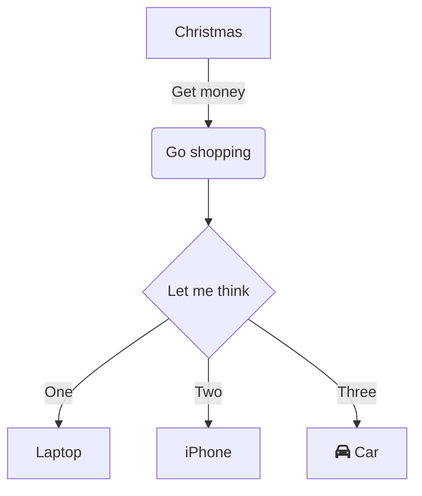
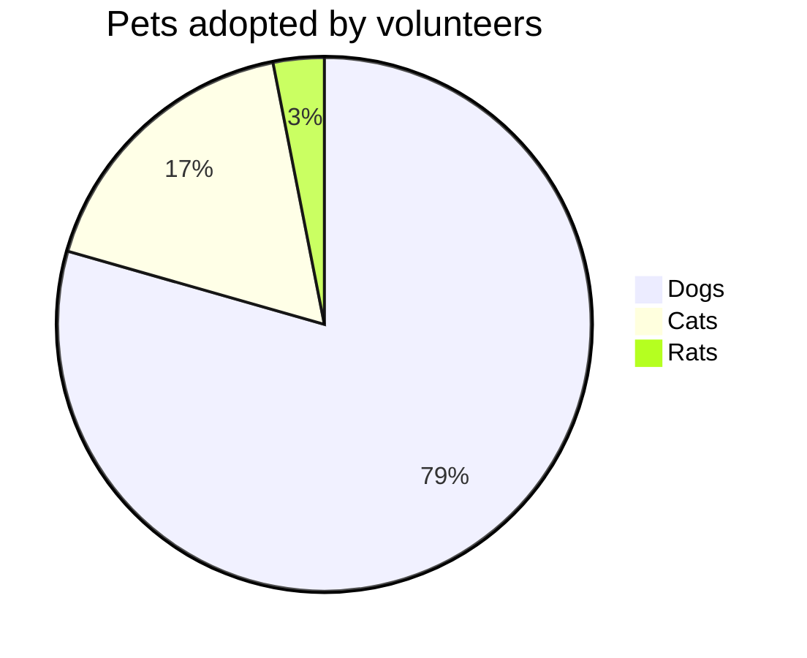

# Overview

example markdown with mermaid:



with snippet code:
```kotlin
package com.dargoz

import com.dargoz.di.featureModule
import com.dargoz.domain.entities.FeatureEntity
import com.dargoz.domain.usecases.FeatureUseCase
import org.koin.core.component.KoinComponent
import org.koin.core.component.inject
import org.koin.core.context.startKoin

fun initFeatureKoin() {
    startKoin {
        modules(featureModule())
    }
}

class FeatureHelper: KoinComponent {
    private val featureUseCase: FeatureUseCase by inject()

    suspend fun executeFeatureUseCase(): IResult<FeatureEntity> {
        val useCase = featureUseCase("")
        return useCase
    }

}
```

another chart:
